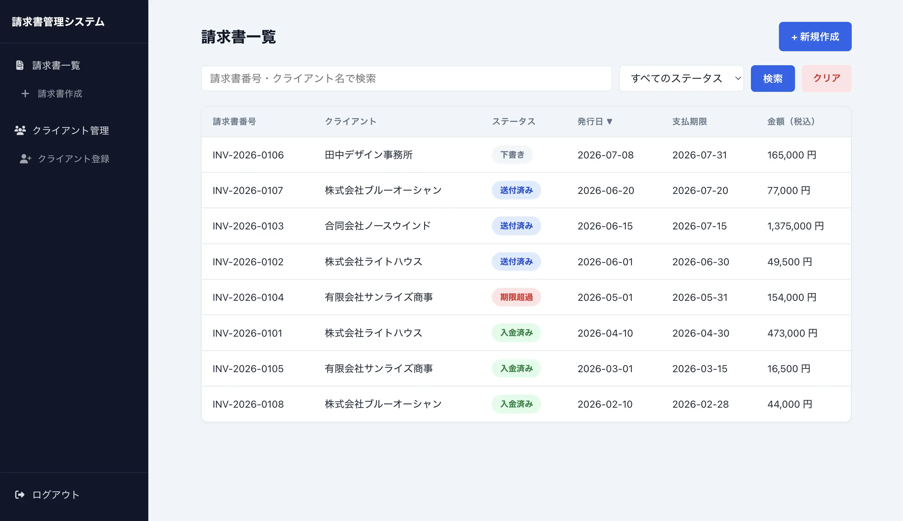

# ①課題名

請求書管理システム

## ②課題内容（どんな作品か）

- 業務で発生する請求書を、クライアントごとに作成・管理するアプリです。

## ③アプリのデプロイURL

- https://gs2026-arakawa.sakura.ne.jp/kadai08_db2/public/login.php

## ④アプリのログイン用IDまたはPassword（ある場合）

- ユーザー名：admin
- パスワード：mypassword02

## ⑤工夫した点・こだわった点

- セッション管理によるログイン認証を実装し、`config/auth.php` に集約することで全ページで共通のログインチェック・タイムアウト処理を行えるようにしました。
- `clients`（クライアント）・`invoices`（請求書）・`invoice_items`（明細）の3テーブルをリレーション設計し、`invoices ↔ invoice_items` は `ON DELETE CASCADE` で請求書削除時に明細も自動削除されるようにしました。
- 請求書本体と複数の明細行の登録・更新を、トランザクション（`beginTransaction` / `commit` / `rollBack`）で囲むことで、途中で失敗しても中途半端なデータが残らないようにしました。

## ⑥難しかった点・次回トライしたいこと（又は機能）

- 次回は、請求書をfree APIと接続して作成できるようにすることにチャレンジしたいです。
- あわせて、請求書一覧を JSON で返す PHP API を用意し、React（useEffect + fetch + map）で一覧を表示する構成にも挑戦したいと考えています。

## ⑦フリー項目（感想、シェアしたいこと等なんでも）

前回のPHP課題（在庫管理）で身につけた DB設計・CRUD・JOIN・セッション管理の発展版として作成しました。 
今後は Reactでのフロントエンド化を進め、実務でも使えるレベルに育てていきたいです。
