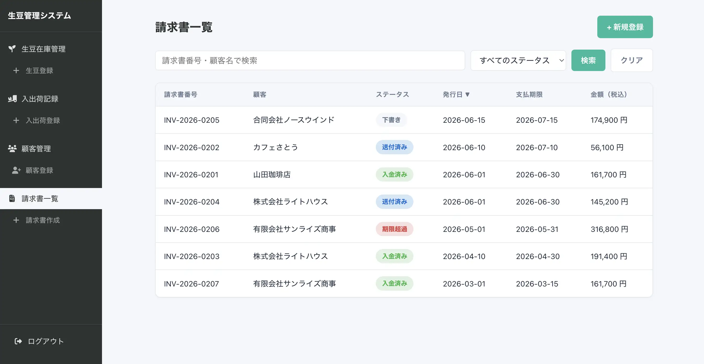
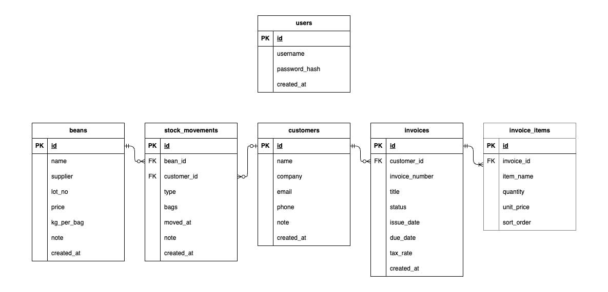

# ①課題名

生豆管理システムv2

## ②課題内容（どんな作品か）

- 前回の課題で作成したコーヒー生豆在庫管理アプリに、請求書を作成・管理する機能を追加しました。

## ③アプリのデプロイURL

- https://gs2026-arakawa.sakura.ne.jp/kadai08_db2_v2/public/login.php

## ④アプリのログイン用IDまたはPassword（ある場合）

- ユーザー名：admin
- パスワード：mypassword02

## ⑤工夫した点・こだわった点

- DB接続情報は `.env` に切り出し、`config/env.php` で読み込む形にすることで、`config/db.php` に認証情報をハードコードせず、`.gitignore` でリポジトリにも含まれないようにしました。
- 生豆の商品名・仕入先の入力欄はHTML標準の `<datalist>` を使い、既存の登録データを候補として出しつつ自由入力もできるようにしました（新規入力・追記どちらもスムーズに行えます）。

- `beans`（生豆銘柄）・`customers`（顧客）・`invoices`（請求書）・`invoice_items`（明細）・`stock_movements`（入出荷記録）をリレーション設計しました。

削除時の挙動は以下のとおりです。

- **請求書 ↔ 明細、生豆 ↔ 入出荷記録**：親を削除すると子も自動的に削除されます（`ON DELETE CASCADE`）。明細や記録だけが単独で残っても意味がないためです。
- **顧客 ↔ 請求書**：請求書が紐づいている顧客は削除できません（`NO ACTION`）。請求実績のある顧客を誤って削除すると、過去の請求書がどの顧客のものか分からなくなるのを防ぐためです。
- **顧客 ↔ 入出荷記録**：顧客を削除しても、入出荷記録は削除せず「顧客未設定」の状態で残します（`ON DELETE SET NULL`）。入出荷の記録自体は在庫管理上重要な情報なので、顧客の有無にかかわらず保持したいためです。

## ⑥難しかった点・次回トライしたいこと（又は機能）

- 2つの課題（請求書管理・生豆管理）は最初は別々のDBとして作っていたため、統合時に顧客テーブルの項目差分（会社名・電話番号・備考の有無）を吸収しつつ、両方の機能から同じ顧客テーブルを参照できるようにする作業が大変でした。

## ⑦フリー項目（感想、シェアしたいこと等なんでも）

前回のPHP課題（在庫管理）で身につけた DB設計・CRUD・JOIN・セッション管理をベースに、今回の請求書管理を組み合わせて1つの業務アプリに育てました。 
今後は Reactでのフロントエンド化を進め、実務でも使えるレベルに育てていきたいです。
